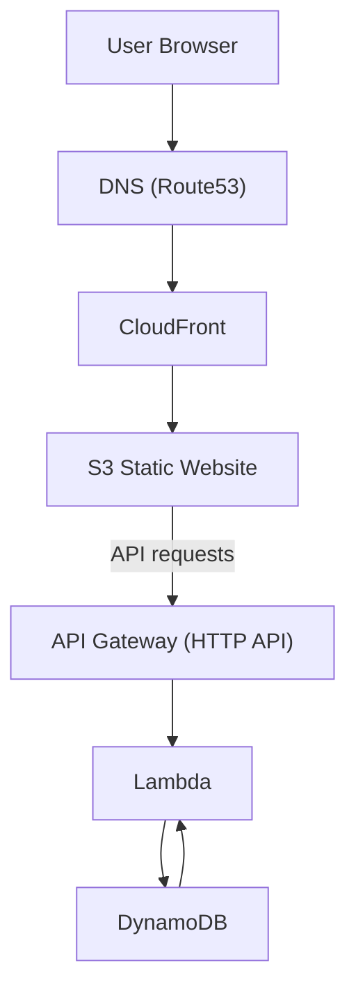

# My Resume IaC

Terraform infrastructure for a resume website with a page view counter on AWS.

## Architecture

- `janice-zhong.com` resolves to a CloudFront distribution backed by an S3 static website bucket.
- The site calls an HTTP API Gateway, which invokes Lambda to read/write a DynamoDB counter.
- TLS: ACM cert in `us-east-1` for CloudFront and in `ap-southeast-2` for API Gateway.



## Prerequisites

- Terraform >= 1.14.3
- HCP Terraform connected via VCS; this repo is the source of truth.

## AWS Authentication

HCP Terraform uses OIDC to assume an AWS role. These environment variables are set in HCP Terraform:

```bash
TFC_AWS_PROVIDER_AUTH=true
TFC_AWS_RUN_ROLE_ARN=<role_arn>
```

## Environments

- Staging and production workspaces.
- Manual approvals required for `terraform apply` in both.

## Repo Layout

- `main.tf` core resources and provider config
- `webfront.tf` S3 + CloudFront
- `api.tf` + `lambda.tf` API Gateway and Lambda
- `dynamodb.tf` visit counter storage
- `route53.tf` DNS and records
- `acm.tf` TLS certificates

## Deployment

Deployments run in HCP Terraform after VCS changes are merged. Use the workspace UI to review plan and apply.
