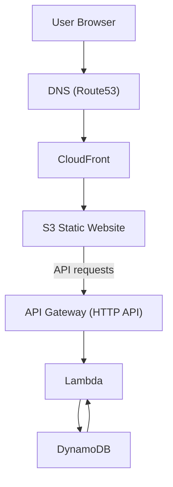

# Serverless Portfolio IaC

This repository contains the Infrastructure as Code (IaC) for the [Serverless Portfolio](https://github.com/qianzhong516/serverless-portfolio). It provisions and manages the AWS infrastructure using Terraform and HCP Terraform, supporting automated infrastructure deployments and separate staging and production environments.

## Table of Contents

- [Technologies](#technologies)
- [Architecture](#architecture)
- [CI/CD](#cicd)
- [Multi-environment Deployment](#multi-environment-deployment)
- [Repo Layout](#repo-layout)
- [Deployment Flow](#deployment-flow)

## Technologies

- Terraform
- HCP Terraform
- AWS IAM
- Amazon S3
- CloudFront
- API Gateway
- Lambda
- DynamoDB
- Route53
- ACM

## Architecture

- Infrastructure is organized into logical Terraform files by AWS service.
- Environment-specific configurations are managed by Terraform workspaces.
- State is managed remotely by HCP Terraform.


```mermaid
flowchart TD
    User[User Browser]
    DNS["DNS (Route53)"]
    CF[CloudFront]
    S3[S3 Static Website]
    APIGW["API Gateway (HTTP API)"]
    Lambda[Lambda]
    DynamoDB[DynamoDB]

    User --> DNS
    DNS --> CF
    CF --> S3
    S3 -->|API requests | APIGW
    APIGW --> Lambda
    Lambda --> DynamoDB
    DynamoDB --> Lambda
```

## CI/CD

"Pushes to main" will trigger a `terraform plan` execution in HCP Terraform. Manual approvals are required to run `terraform apply`.

HCP Terraform authenticates to AWS using OpenID Connect (OIDC), eliminating the need for long-lived AWS credentials.

## Multi-environment Deployment

Separate Terraform workspaces isolate staging and production while allowing both environments to share the same Terraform configuration.

## Repo Layout

```
.
├── acm.tf          # TLS certificates
├── api.tf          # API Gateway
├── dynamodb.tf     # Visitor counter storage
├── lambda.tf       # Lambda function
├── route53.tf      # DNS
├── webfront.tf     # S3 + CloudFront
├── variables.tf
├── outputs.tf
└── main.tf         # Core resources and provider config
```

## Deployment Flow

```
Developer
    │
    │ git push main
    ▼
GitHub Repository
    │
    │ VCS integration
    ▼
HCP Terraform
    │
    ├── terraform plan
    │
    ▼
Manual Approval
    │
    ▼
terraform apply
    │
    ▼
AWS Infrastructure
 ├── S3
 ├── CloudFront
 ├── API Gateway
 ├── Lambda
 ├── DynamoDB
 ├── Route53
 └── ACM
```
